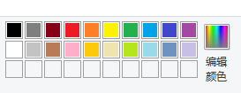

# Markdown 相关命令
## 一、标题
### 1、使用=和-标记一级二级标题
    这里展示的是一级标题
    ==================
    这里展示的是二级标题
    ------------------
效果 =>

这里展示的是一级标题
==================
这里展示的是二级标题
------------------

### 2、使用#表示标题
    # 一级标题
    ## 二级标题
    ### 三级标题
    #### 四级标题
    ##### 五级标题
    ###### 六级标题

# 一级标题
## 二级标题
### 三级标题
#### 四级标题
##### 五级标题
###### 六级标题

## 二、段落

换行：
1. 末尾加两个或多个空格加回车 “  ” + 回车
2. 使用空行作为换行


## 三、字体
    *斜体文本*
    _斜体文本_
    **粗体文本**
    __粗体文本__
    ***粗斜体文本***
    ___粗斜体文本___

*斜体文本*  
_斜体文本_  
**粗体文本**  
__粗体文本__  
***粗斜体文本***  
___粗斜体文本___  


## 四、分割线

**三个以上的‘*’、‘-’、‘_’都可以构成分割线，也可以在每个符号之间加入空格‘ ’**

***

## 五、区块引用

每行或每段前面加">", 可嵌套 ">"

    > 区块引用

效果=>

> 区块引用


## 六、列表

无序列表使用星号（"*"）、加号("+")或是减号("-")作为列表标记：

    * 列表1
    + 列表2
    - 列表3

* 列表1
+ 列表2
- 列表3

有序列表则使用数字接着一个英文句点：

1.  Bird
    sfagsda
2.  McHale
3.  Parish

## 七、链接

    这是一个[链接](./image/截图1.png "截图1")
=======>
这是一个[链接](./image/截图1.png "截图1")

### 1、相对路径

    相对路径：这是我的[正则表达式总结](./正则表达式.md)
=====>

相对路径：这是我的[正则表达式总结](./正则表达式.md)

### 2、多个链接可统一赋值路由
    先定义链接文字[正则表达式][regex],再在任意文章位置定义链接路由；
    [regex]: ./正则表达式.md
=====>

先定义链接文字 [正则表达式] [regex] ,再在任意文章位置定义链接路由；   
[regex]:    <./正则表达式.md>

## 八、代码
#### 1、如果要标记一小段行内代码，你可以用反引号把它包起来（```）
    this is `printf()` output;
=====>

this is `printf()` output;

## 九、 图片
### 1、行内式
        
=====>   


### 2、参考式
    ![Alt text][1] 
    [1]: ./image/截图1.png "截图1"
======>     
![Alt text][1]       
    [1]: ./image/截图1.png "截图1"

## 十、表格

    | 左对齐 | 右对齐 | 居中对齐 |
    | :-----| ----: | :----: |
    | 单元格 | 单元格 | 单元格 |
    | 单元格 | 单元格 | 单元格 |

======>
| 左对齐 | 右对齐 | 居中对齐 |
| :-----| ----: | :----: |
| 单元格 | 单元格 | 单元格 |
| 单元格 | 单元格 | 单元格 |


## 其他

Markdown 支持以下这些符号前面加上反斜杠来帮助插入普通的符号：

    \   反斜线
    `   反引号
    *   星号
    _   底线
    {}  花括号
    []  方括号
    ()  括弧
    #   井字号
    +   加号
    -   减号
    .   英文句点
    !   惊叹号